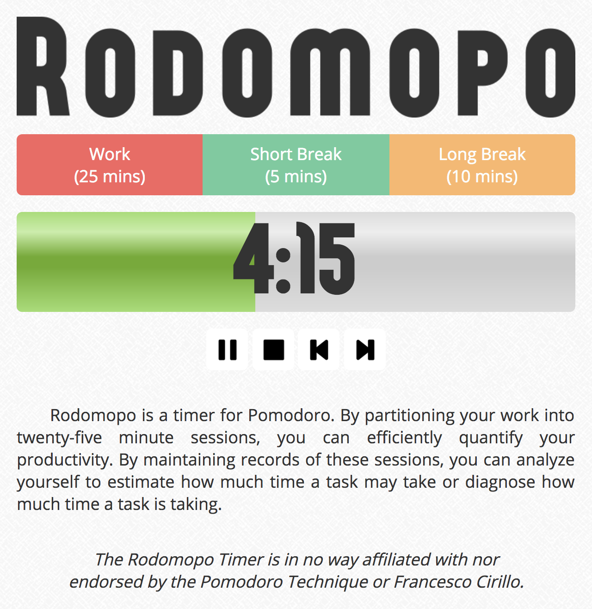

# Rodomopo #

A timer for the [Pomodoro Technique](http://pomodorotechnique.com).

### Current Features ###
* Handles a variety of different lengths in timers.
* Provides an interface for handling the timer.
* Renders the timer in both text and meter.
* Plays a sound when the timer has finished.
* Records the timestamps and data of each session.
* Updates the title of page to also display the timer.
* Supports most modern browsers.
* Support mobile screens.

### Planned Features ###
* Implements a few keyboard shortcuts.
* Gives prompts as the timer is almost finished.
* Pops up notifications when the timer has finished.
* Should work play sound even when browser is tabbed out.
